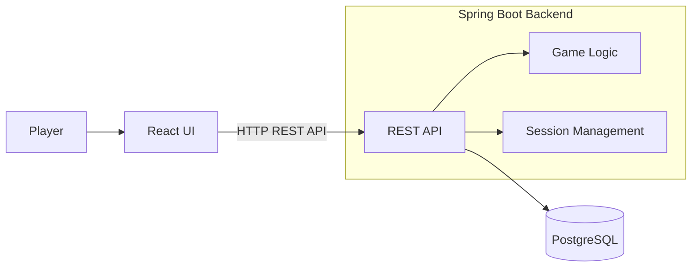

# Rock Paper Scissors

## Table of Content

* [Introduction](#introduction)
* [Architecture](#architecture)
* [Tech Stack](#tech-stack)
* [API Endpoints](#api-endpoints)
* [Start the Project](#start-the-project)

## Introduction

A full-stack Rock Paper Scissors web application built with a Java Spring Boot backend and a React frontend.  
The project consists of a React frontend, a Spring Boot REST API backend, and a Docker-based PostgreSQL database for data persistence.

[rps_game_demo.mp4](https://github.com/user-attachments/assets/68efa3f6-dca1-489b-8cd0-f0f891ae38bc)

## Architecture



## Tech Stack

### Frontend

The frontend is built with **React + TypeScript** and styled using **Tailwind CSS**.  
It communicates with the backend via HTTP requests.

**Technologies:**

- React
- TypeScript
- Tailwind CSS
- Vite
- HTML

### Backend

The backend is built with **Spring Boot** and uses **Gradle** as the build tool.  
It provides the game logic through a REST API and handles:

- Processing player moves and calculating game results
- Managing game sessions and tracking the current win streak
- Persisting leaderboard data with PostgreSQL

**Technologies:**

- Java
- Spring Boot
- Spring Web
- Spring Data JPA
- PostgreSQL
- Gradle


## API Endpoints

| Method | Endpoint | Description |
|--------|----------|-------------|
| GET | `/play?choice={choice}` | Plays a game round with the player's choice |
| POST | `/highscore/finish?playerName={name}` | Saves the player's final score after game over |
| GET | `/highscore` | Retrieves the leaderboard |


## Start the Project

```bash
docker-compose up -d
```
